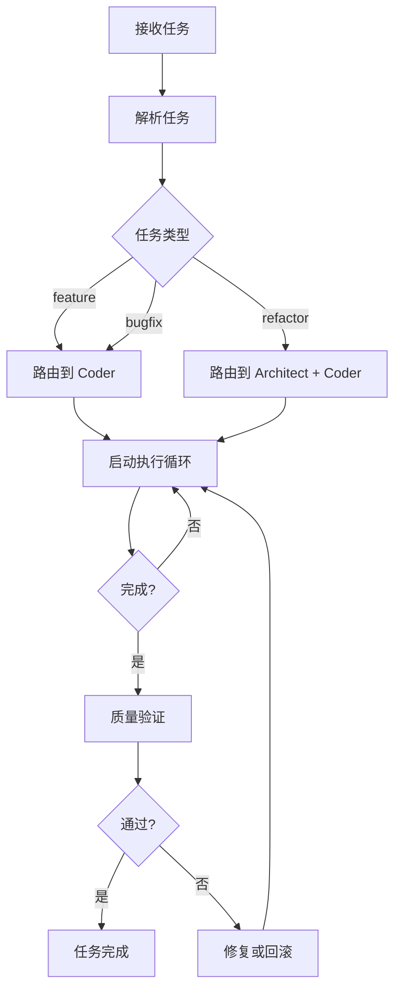

# 任务分发器 (Dispatcher)

## 职责

接收任务请求,解析任务类型,路由到合适的角色,启动执行循环。

## 工作流程



## 实现

### 伪代码

```python
def dispatch(task_file: Path):
    """分发任务到合适的角色. """
    # 1. 解析任务
    task = parse_task(task_file)

    # 2. 验证任务
    validate_task(task)

    # 3. 路由到角色
    role = route_to_role(task)

    # 4. 加载上下文
    context = load_context(task)

    # 5. 执行任务
    result = execute_task(task, role, context)

    # 6. 验证结果
    verify_result(task, result)

    return result

def route_to_role(task: Task) -> Role:
    """根据任务类型路由. """
    routing = {
        "feature": "coder",
        "bugfix": "coder",
        "refactor": "architect+coder"
    }
    return routing[task.type]

def load_context(task: Task) -> Context:
    """加载必要的上下文. """
    context = Context()

    # 始终加载
    context.add("invariants", load("docs/arch/invariants.md"))

    # 条件加载
    if task.type == "refactor":
        context.add("boundaries", load("docs/arch/boundaries.md"))

    if task.owner_role == "coder":
        context.add("conventions", load("docs/rd/dev-conventions.md"))
        context.add("pitfalls", load("docs/rd/pitfalls.md"))

    return context
```

## 命令行接口

```bash
# 分发任务
python -m harness.runtime.dispatcher TASK-001

# 交互式分发
python -m harness.runtime.dispatcher --interactive
```

## 输出

执行过程输出:

```
[INFO] 解析任务: TASK-001
[INFO] 任务类型: feature
[INFO] 路由到: coder
[INFO] 加载上下文:
  - docs/arch/invariants.md
  - docs/rd/dev-conventions.md
  - docs/rd/pitfalls.md
[INFO] 开始执行...
[INFO] 执行完成,开始验证...
[INFO] Lint 通过
[INFO] 测试通过
[INFO] 质量评分: 85/100
[SUCCESS] 任务完成
```

## 错误处理

### 任务验证失败

```python
class TaskValidationError(Exception):
    """任务不符合 schema. """

    def __init__(self, errors):
        self.errors = errors
```

**处理**:
- 列出所有验证错误
- 建议如何修复
- 拒绝执行

### 执行失败

**处理**:
1. 记录失败原因
2. 保留部分状态
3. 建议:
   - 修复后继续
   - 回滚到之前状态
   - 升级给人类

### 评分下降

**处理**:
1. 识别评分下降的原因
2. 如果是新功能,更新基线
3. 如果是退化,必须修复
4. 记录到 `known-issues.md`
