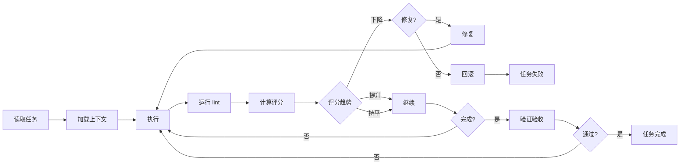

# 执行循环 (Execution Loop)

## 职责

控制任务的执行过程,实现反馈循环: 执行 → 验证 → 评分 → 决策。

## 循环逻辑



## 实现

### 核心循环

```python
def execution_loop(task: Task, context: Context) -> Result:
    """执行任务的主循环. """
    baseline_score = compute_baseline_score()
    current_score = baseline_score
    iteration = 0

    while True:
        iteration += 1
        logger.info(f"=== 迭代 {iteration} ===")

        # 1. 执行任务
        execute(task, context)

        # 2. 运行检查
        lint_result = run_checks()

        if not lint_result.passed:
            logger.error("Lint 失败,必须修复")
            suggest_fixes(lint_result.errors)
            continue  # 返回执行

        # 3. 计算评分
        current_score = compute_score()

        logger.info(f"当前评分: {current_score}")
        logger.info(f"基线评分: {baseline_score}")
        logger.info(f"评分变化: {current_score - baseline_score:+.1f}")

        # 4. 决策
        if current_score < baseline_score - 10:
            # 评分大幅下降,必须修复
            logger.error("评分显著下降,必须修复")
            if not ask_to_fix():
                rollback()
                raise TaskFailed("评分下降,用户取消")

        elif current_score < baseline_score:
            # 轻微下降,询问
            logger.warning("评分轻微下降")
            if not ask_to_continue():
                rollback()
                raise TaskFailed("用户取消")

        # 5. 检查完成条件
        if is_complete(task, current_score):
            logger.info("任务完成")
            return Result(success=True, score=current_score)

        # 6. 继续迭代
        logger.info("继续优化...")
```

### 检查执行

```python
def run_checks() -> LintResult:
    """运行所有检查. """
    results = {
        "arch": run_check("scripts/checks/arch"),
        "code": run_check("scripts/checks/code"),
        "qa": run_check("scripts/checks/qa")
    }

    passed = all(r.passed for r in results.values())

    return LintResult(
        passed=passed,
        details=results
    )
```

### 评分计算

```python
def compute_score() -> float:
    """计算质量评分. """
    policy = load_policy("scripts/policy/policy.yaml")

    total_score = 0
    total_weight = 0

    for check_name, check_config in policy.items():
        result = run_check(check_config.path)

        score = result.score * check_config.weight
        total_score += score
        total_weight += check_config.weight

    return total_score / total_weight if total_weight > 0 else 0
```

### 完成检查

```python
def is_complete(task: Task, score: float) -> bool:
    """检查任务是否完成. """
    # 1. 验收标准检查
    for criterion in task.acceptance_criteria:
        if not verify_criterion(criterion):
            logger.info(f"验收标准未满足: {criterion}")
            return False

    # 2. 评分检查
    if score < MINIMUM_SCORE:
        logger.info(f"评分未达标: {score} < {MINIMUM_SCORE}")
        return False

    # 3. 所有检查通过
    lint_result = run_checks()
    if not lint_result.passed:
        return False

    return True
```

## 决策阈值

### 评分变化决策

| 变化 | 动作 |
|------|------|
| ≥ +5 | 记录最佳实践 |
| ±5   | 继续执行 |
| -5 ~ -10 | 警告,询问是否继续 |
| < -10 | 必须修复或回滚 |

### 质量门禁

| 维度 | 最低分 | 权重 |
|------|--------|------|
| 架构合规 | 30/40 | 40% |
| 测试覆盖 | 20/30 | 30% |
| Lint 通过 | 15/20 | 20% |
| 文档完整 | 5/10 | 10% |
| **总计** | **70/100** | - |

## 错误恢复

### 修复模式

```python
def fix_issues(lint_result: LintResult):
    """自动修复简单问题. """
    for error in lint_result.errors:
        if error.auto_fixable:
            apply_fix(error)
            logger.info(f"自动修复: {error.message}")
```

### 回滚模式

```python
def rollback():
    """回滚到之前状态. """
    # Git 回滚
    subprocess.run(["git", "checkout", "--", "."])

    # 清理临时文件
    cleanup_temp_files()

    logger.warning("已回滚所有更改")
```

### 升级模式

```python
def escalate(task: Task, issue: str):
    """升级给人类处理. """
    # 记录到 known-issues
    add_to_known_issues(task, issue)

    # 通知用户
    notify_user(task, issue)

    raise HumanInterventionNeeded(issue)
```

## 最佳实践

### 1. 小步迭代

每次迭代应该是小的、可验证的改进:
- ✅ 修复一个 lint 错误
- ✅ 添加一个测试用例
- ✅ 提升一点覆盖率
- ❌ 大规模重构 (应拆分为多个任务)

### 2. 频繁验证

每次代码修改后立即验证:
- 运行相关测试
- 检查 lint
- 计算评分

### 3. 快速失败

如果发现无法恢复的错误:
- 立即停止
- 保留诊断信息
- 不要浪费时间继续

### 4. 渐进增强

优先保证正确性,再优化性能:
1. 先让功能工作
2. 再提升质量
3. 最后优化性能
